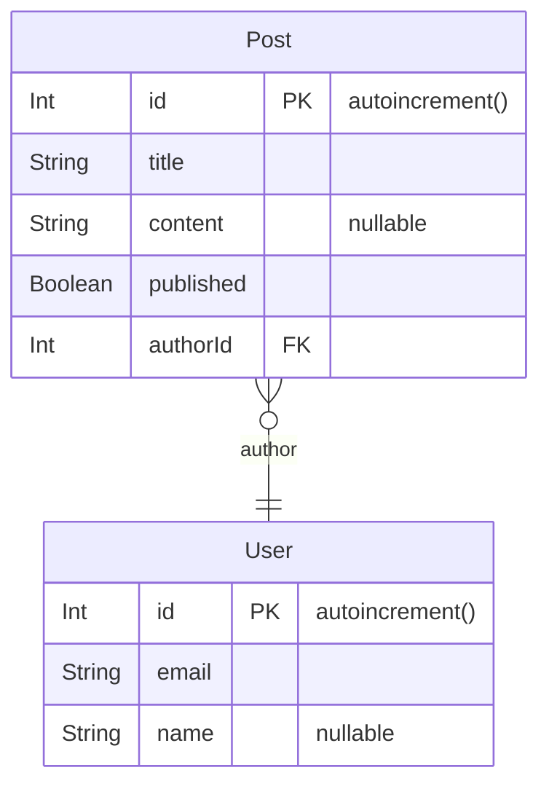

# Blog-Service

An API for serve a backend to manage a simple blog.

## Prerequisites

- NodeJS (v16+)
- Typescript
- MongoDB

## Tech Stack

**Built-in:**

- [NodeJS](https://nodejs.org/)
- [Typescript](https://www.typescriptlang.org/)
- [Prisma](https://www.prisma.io/)
- [Docker](https://www.docker.com/)
- [MongoDB](https://www.mongodb.com/pt-br)
- [Jest](https://jestjs.io/)

## Setup

```bash
npm install
```

Create `.env` file:

```bash
cp .env.example .env
```

> 💭 Don't forget to fill environments variables in .env file.

Start MongoDB using Docker-Compose:

```bash
docker-compose up -d
```

> ⚠️ Because this app use Prisma, the MongoDB must be set a replicaSet.
>
> See in docs: [Prisma](https://www.prisma.io/docs/concepts/database-connectors/mongodb).

Generate schema:

```bash
npm run generate
```

```prisma
model Post {
  id        String   @id @default(auto()) @map("_id") @db.ObjectId
  text      String
  user      User     @relation(fields: [userId], references: [id])
  userId    String   @db.ObjectId
  createdAt DateTime @default(now())
}

model User {
  id       String @id @default(auto()) @map("_id") @db.ObjectId
  name     String
  nickname String
  posts    Post[]
}
```

This diagram will be generated:<br>
This diagram will be created in prisma folder.



## Running

You can running using node scripts or makefile.

### Node

```bash
npm run dev
```

or

```bash
npm run watch
```

to run using compiled:

```bash
npm run start
```

### Makefile

Building image

```bash
make build
```

Starting

```bash
make start
```

## Authors

- **Leo Yassuda**
