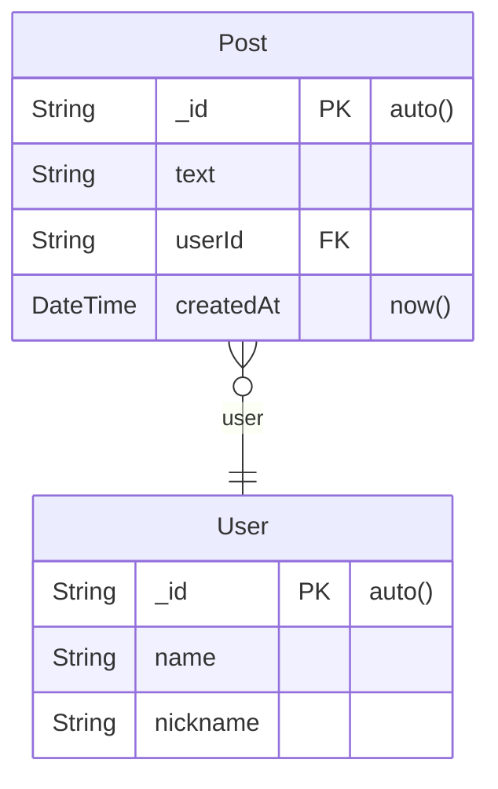

```mermaid
erDiagram
	Post {
		String _id PK  "auto()"
		String text
		String userId FK
		DateTime createdAt  "now()"
	}
	User {
		String _id PK  "auto()"
		String name
		String nickname
	}
	Post }o--|| User : user

```
